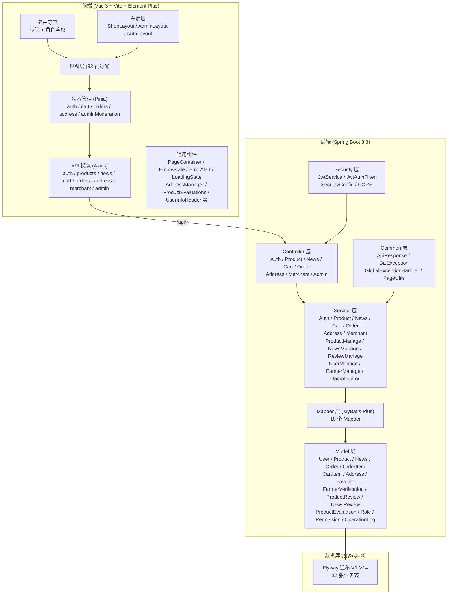
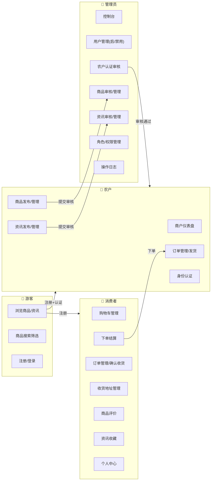
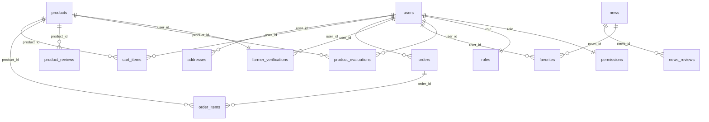
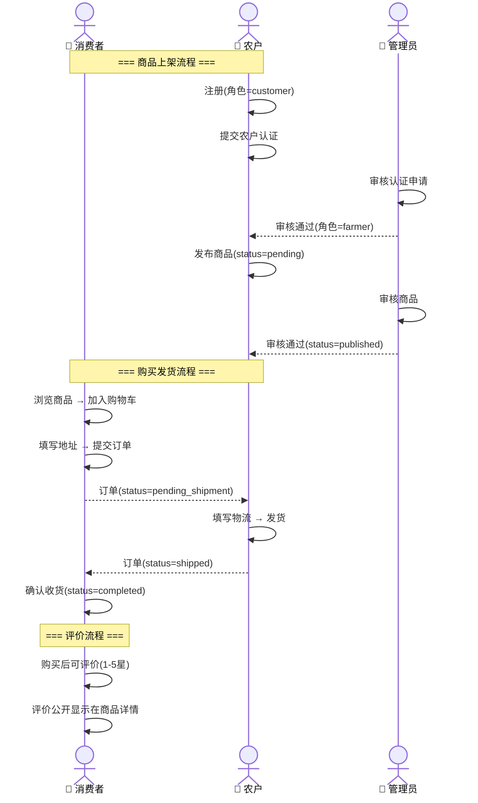
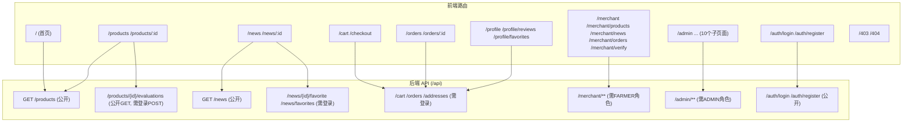

# 智慧三农平台

农产品产销直连电商平台，支持消费者选购、农户入驻经营、平台管理员审核管理的完整业务闭环。

## 技术栈

| 层级 | 技术 |
|------|------|
| 前端 | Vue 3 + Vite + Pinia + Vue Router + Element Plus |
| 后端 | Spring Boot 3.3 + MyBatis-Plus 3.5 + MySQL 8 |
| 认证 | Spring Security + JWT (jjwt) |
| 数据库迁移 | Flyway |
| 测试 | Vitest (单元) + Playwright (E2E) + JUnit (后端集成) |
| API 文档 | Swagger / SpringDoc |

## 项目结构

```
├── backend/                     # Spring Boot 后端
│   ├── src/main/java/.../
│   │   ├── config/              # 安全配置、CORS
│   │   ├── controller/          # REST 接口
│   │   │   └── admin/           # 管理后台接口
│   │   ├── dto/                 # 请求体 DTO
│   │   ├── mapper/              # MyBatis-Plus Mapper
│   │   ├── model/               # 实体类
│   │   ├── security/            # JWT 工具、过滤器
│   │   ├── service/             # 业务逻辑层
│   │   └── common/              # 异常处理、统一响应
│   └── src/main/resources/
│       └── db/migration/        # Flyway SQL 迁移脚本
├── src/                         # Vue 3 前端
│   ├── api/                     # Axios 封装 + API 模块
│   ├── components/              # 通用组件
│   ├── constants/               # 常量定义
│   ├── layouts/                 # 布局组件（商城/后台/登录）
│   ├── mocks/                   # 本地 Mock 数据
│   ├── router/                  # 路由配置 + 守卫
│   ├── stores/                  # Pinia 状态管理
│   ├── styles/                  # 全局样式
│   └── views/                   # 页面视图
│       ├── admin/               # 管理后台页面
│       ├── auth/                # 登录/注册
│       ├── common/              # 403/404 页面
│       └── shop/                # 商城页面
├── e2e/                         # Playwright E2E 测试
└── public/                      # 静态资源
```

## 快速开始

### 环境要求

- JDK 17+
- Maven 3.9+
- MySQL 8.0+
- Node.js 20+

### 1. 创建数据库

```sql
CREATE DATABASE zhhs_nong DEFAULT CHARACTER SET utf8mb4;
```

### 2. 配置数据库连接

默认连接 `localhost:3306/zhhs_nong`，用户 `root`，密码 `20031202`。

如需修改，设置环境变量：

```powershell
$env:DB_HOST = "localhost"
$env:DB_PORT = "3306"
$env:DB_NAME = "zhhs_nong"
$env:DB_USER = "root"
$env:DB_PASSWORD = "20031202"
```

### 3. 启动后端

```powershell
cd backend
mvn spring-boot:run
```

启动后 Flyway 自动建表并写入种子数据。访问 Swagger 文档：

```
http://localhost:8080/swagger-ui.html
```

### 4. 启动前端

```powershell
npm install
npm run dev
```

浏览器打开 `http://localhost:5173`，前端 `/api` 请求自动代理到后端 `localhost:8080`。

## 示例账号

| 角色 | 手机号 | 密码 |
|------|--------|------|
| 管理员 | 13800000000 | 12345678 |
| 消费者 | 13900000000 | 12345678 |
| 农户 | 13600000000 | 12345678 |

## 用户角色

| 角色 | 权限 |
|------|------|
| 游客 | 浏览商品、资讯 |
| 消费者 | 购物车、下单、订单管理、个人中心 |
| 农户 | 商户后台、商品管理、资讯发布、身份认证 |
| 管理员 | 用户管理、认证审核、商品审核、资讯审核、角色权限、操作日志 |

## 功能模块

### 商城（消费者）

- 首页：Banner、商品分类、热销推荐、三农资讯
- 商品浏览：列表、详情、分类/产地/关键词筛选、分页
- 购物车：添加、修改数量、删除、合计
- 下单结算：收货地址管理、订单提交
- 我的订单：订单列表、订单详情、确认收货
- 个人中心：账号信息、地址管理（CRUD + 默认地址）
- 三农资讯：新闻列表、详情、分类筛选

### 商户后台（农户）

- 商户仪表盘：商品数、订单数、资讯数统计
- 商品管理：新增、编辑、删除、提交审核
- 资讯管理：新增、编辑、删除、提交审核
- 身份认证：提交营业执照/身份证信息

### 管理后台（管理员）

- 控制台：待审统计 + 最近操作日志
- 用户管理：列表、筛选、禁用/启用
- 农户审核：查看认证详情、通过/驳回（含原因）
- 商品管理：全部商品列表、搜索
- 商品审核：通过/驳回审核
- 资讯管理：全部资讯列表、搜索
- 资讯审核：通过/驳回审核
- 角色管理：角色成员数调整
- 权限配置：模块-角色-操作权限矩阵
- 操作日志：操作记录查询、分页

## API 接口

### 公开接口

| 方法 | 路径 | 说明 |
|------|------|------|
| POST | `/api/auth/register` | 用户注册 |
| POST | `/api/auth/login` | 用户登录 |
| GET | `/api/products` | 商品列表（支持 keyword/category/region/page/pageSize） |
| GET | `/api/products/{id}` | 商品详情 |
| GET | `/api/news` | 资讯列表（支持 keyword/category/page/pageSize） |
| GET | `/api/news/{id}` | 资讯详情 |

### 用户接口（需登录）

| 方法 | 路径 | 说明 |
|------|------|------|
| GET | `/api/auth/profile` | 获取当前用户信息 |
| GET | `/api/cart` | 获取购物车 |
| POST | `/api/cart/items` | 添加商品到购物车 |
| PUT | `/api/cart/items/{id}` | 修改购物车商品数量 |
| DELETE | `/api/cart/items/{id}` | 删除购物车商品 |
| GET | `/api/addresses` | 获取收货地址列表 |
| POST | `/api/addresses` | 新增收货地址 |
| PUT | `/api/addresses/{id}` | 更新收货地址 |
| DELETE | `/api/addresses/{id}` | 删除收货地址 |
| GET | `/api/orders` | 订单列表 |
| GET | `/api/orders/{id}` | 订单详情 |
| POST | `/api/orders` | 创建订单（从购物车结算） |
| POST | `/api/orders/{id}/confirm-receipt` | 确认收货 |

### 商户接口（需农户角色）

| 方法 | 路径 | 说明 |
|------|------|------|
| GET | `/api/merchant/dashboard` | 商户仪表盘统计 |
| POST | `/api/merchant/verify` | 提交农户认证 |
| GET | `/api/merchant/products` | 我的商品列表 |
| POST | `/api/merchant/products` | 新增商品 |
| PUT | `/api/merchant/products/{id}` | 编辑商品 |
| DELETE | `/api/merchant/products/{id}` | 删除商品 |
| GET | `/api/merchant/news` | 我的资讯列表 |
| POST | `/api/merchant/news` | 新增资讯 |
| PUT | `/api/merchant/news/{id}` | 编辑资讯 |
| DELETE | `/api/merchant/news/{id}` | 删除资讯 |

### 管理后台接口（需管理员角色）

| 方法 | 路径 | 说明 |
|------|------|------|
| GET | `/api/admin/users` | 用户列表 |
| PATCH | `/api/admin/users/{id}` | 更新用户状态 |
| GET | `/api/admin/farmer-verifications` | 认证申请列表 |
| POST | `/api/admin/farmer-verifications/{id}/review` | 审核认证 |
| GET | `/api/admin/product-reviews` | 商品审核列表 |
| POST | `/api/admin/product-reviews/{id}/review` | 审核商品 |
| GET | `/api/admin/news-reviews` | 资讯审核列表 |
| POST | `/api/admin/news-reviews/{id}/review` | 审核资讯 |
| GET | `/api/admin/products` | 全部商品 |
| GET | `/api/admin/news` | 全部资讯 |
| GET | `/api/admin/roles` | 角色列表 |
| PATCH | `/api/admin/roles/{id}` | 更新角色成员数 |
| GET | `/api/admin/permissions` | 权限列表 |
| GET | `/api/admin/logs` | 操作日志 |

## 数据库

所有表通过 Flyway 自动创建和维护，迁移脚本位于 `backend/src/main/resources/db/migration/`。

| 文件 | 内容 |
|------|------|
| V1 | 初始化 users / products / news 表 |
| V2 | 种子数据（用户、商品、新闻） |
| V3 | 交易和管理表（addresses / cart_items / orders / order_items / reviews / roles / permissions / operation_logs） |
| V4 | news 增加 category 字段，products/news 增加 user_id |
| V5 | 商品状态 online → published 统一 |
| V6 | products 增加 spec / qualification 字段 |
| V7 | 种子数据汉化 + 新增 10 条商品和 10 条新闻 |
| V8 | 修复种子用户密码哈希 |

## 常用命令

```bash
# 后端编译
cd backend && mvn compile

# 后端启动
cd backend && mvn spring-boot:run

# 后端测试
cd backend && mvn test

# 前端安装依赖
npm install

# 前端开发模式
npm run dev

# 前端构建
npm run build

# 前端单元测试
npm run test:unit

# 代码检查
npm run lint

# 代码格式化
npm run format
```

## 系统架构

### 整体模块架构



### 功能模块与角色权限



### 数据库表关系



### 核心业务流程



### 前后端路由映射


