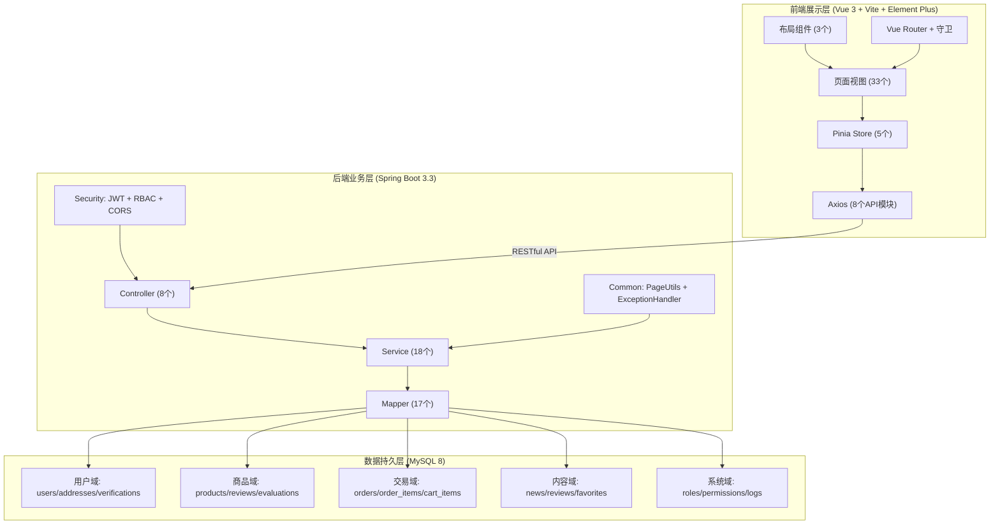

# 智慧三农平台

## 一、项目介绍

### 1.1 项目背景

随着我国农业现代化进程的推进，"三农"问题（农业、农村、农民）始终是国家战略关注的重点领域。当前农产品流通领域仍存在以下痛点：

- **流通环节多**：农产品从产地到消费者餐桌，通常需要经过产地收购商、批发市场、零售商等多个环节，层层加价导致消费者购买成本高，农民获利微薄
- **信息不对称**：消费者难以了解农产品的真实产地、种植方式和质量安全信息，优质农产品缺乏有效的品牌展示渠道
- **农户数字化程度低**：大量中小农户缺乏线上经营能力，无法直接触达终端消费者

### 1.2 平台定位

智慧三农平台是一个**农产品产销直连电子商务平台**，旨在打破传统农产品流通的多层中间环节，为消费者提供"产地直供、绿色安心"的购物体验，为农户提供"零门槛入驻、一键上架"的数字化经营工具。

### 1.3 用户角色

平台面向四类用户设计，形成完整的业务闭环：

| 角色 | 定位 | 核心场景 |
|------|------|---------|
| **游客** | 未注册的访问者 | 浏览商品和资讯，了解平台内容 |
| **消费者** | 有购买需求的终端用户 | 选购农产品、下单支付、收货评价、收藏资讯、管理个人中心 |
| **农户/经营者** | 农产品生产者或经营者 | 提交身份认证、发布商品和资讯、管理订单和发货、商户仪表盘 |
| **平台管理员** | 负责平台日常运营 | 审核认证申请、审核商品和资讯、管理用户、监控运营数据 |

### 1.4 核心价值

- **去中间化**：农户直接发布商品，消费者直接购买，缩短农产品流通链条
- **审核保障**：农户需通过身份认证方可入驻，商品和资讯需经管理员审核后方可公开发布
- **全程可追溯**：订单全生命周期管理（下单→发货→收货），物流信息透明可查
- **双向信任**：消费者购买后可对商品进行 1-5 星评价，评价公开展示辅助购买决策；消费者可收藏感兴趣的内容


## 二、核心业务流程

平台的业务围绕四条主线展开：

### 2.1 商品上架流程

游客注册（注册页不再选择身份，注册后统一为消费者角色）→ 登录后进入个人中心点击"身份认证"→ 提交身份认证（姓名、身份证、统一社会信用代码）→ 管理员审核通过（角色升级为"农户"）→ 农户发布商品（状态为"待审核"）→ 管理员审核商品（通过则"已上架"，驳回则"已驳回"）→ 商品公开可见。

### 2.2 购买发货流程

消费者浏览商品 → 加入购物车 → 填写收货信息 → 提交订单（系统校验库存、扣减库存、创建订单、清空购物车）→ 订单状态为"待发货" → 农户查看关联订单（通过商品→订单明细→订单三层关联查询）→ 农户填写物流单号发货（状态变为"已发货"）→ 消费者确认收货（状态变为"已完成"）→ 消费者对已购商品发表 1-5 星评价（系统验证购买资格）。

### 2.3 资讯流转流程

农户发布资讯（状态为"待审核"）→ 管理员审核通过（状态变为"已发布"并记录发布时间）→ 消费者浏览资讯 → 消费者可收藏/取消收藏资讯 → 个人中心查看收藏列表并管理。

### 2.4 农户认证流程

农户提交认证申请（身份证、统一社会信用代码）→ 管理员查看证照详情 → 审核通过后系统自动将用户角色从"消费者"升级为"农户"→ 农户重新登录获取包含新角色的 JWT Token → 可访问商户后台全部功能。


## 三、技术栈

| 层级 | 技术 | 版本 | 说明 |
|------|------|------|------|
| 前端框架 | Vue 3 + Vite | 3.5 / 8.x | 响应式 SPA，HMR 热更新 |
| UI 组件库 | Element Plus | 2.14 | 企业级 Vue 3 组件库 |
| 状态管理 | Pinia | 3.0 | Vue 官方推荐的状态管理 |
| 路由 | Vue Router | 5.0 | 嵌套路由 + 导航守卫 |
| HTTP 客户端 | Axios | 1.16 | 拦截器统一处理 Token 和错误 |
| 后端框架 | Spring Boot | 3.3.5 | Java 企业级快速开发框架 |
| ORM | MyBatis-Plus | 3.5.7 | Lambda 查询，防 SQL 注入 |
| 安全框架 | Spring Security + JWT | 6.x / jjwt 0.12 | 无状态认证 + RBAC 角色鉴权 |
| 数据库 | MySQL | 8.0 | 可靠的关系型数据库 |
| 数据库迁移 | Flyway | 10.10 | 版本化 SQL 迁移管理 |
| API 文档 | SpringDoc | 2.6 | Swagger UI 自动生成 |
| 测试 | JUnit5 + MockMvc + Vitest + Playwright | — | 三层测试覆盖 |


## 四、项目结构

```
├── backend/                          # Spring Boot 后端
│   ├── src/main/java/com/zhhs/nong/
│   │   ├── common/                   # 公共组件
│   │   │   ├── PageUtils.java        # 分页工具
│   │   │   └── exception/            # BizException + GlobalExceptionHandler
│   │   ├── config/                   # SecurityConfig / CORS / Flyway
│   │   ├── controller/               # REST 控制器（8 个）
│   │   │   └── admin/                # 管理后台接口
│   │   ├── dto/                      # 请求体 DTO
│   │   │   ├── auth/                 # 认证相关 DTO
│   │   │   ├── admin/                # 管理后台 DTO
│   │   │   ├── merchant/             # 商户端 DTO
│   │   │   └── trade/                # 交易相关 DTO
│   │   ├── mapper/                   # MyBatis-Plus Mapper（17 个）
│   │   ├── model/                    # 实体类（15 张表）
│   │   ├── security/                 # JWT 工具、认证过滤器
│   │   └── service/                  # 业务逻辑层（18 个 Service）
│   └── src/main/resources/
│       ├── application.yml           # 主配置（MySQL + Flyway + JWT）
│       ├── application-test.yml      # 测试配置（H2 内存数据库）
│       └── db/migration/             # Flyway 迁移脚本（V1-V14）
│
├── src/                              # Vue 3 前端
│   ├── api/                          # Axios 封装
│   │   ├── http.js                   # 拦截器（Token 注入 + 错误处理）
│   │   └── modules/                  # 8 个 API 模块
│   │       ├── auth.js               # 认证 APIs
│   │       ├── products.js           # 商品 + 评价 APIs
│   │       ├── news.js               # 新闻 + 收藏 APIs
│   │       ├── cart.js               # 购物车 APIs
│   │       ├── orders.js             # 订单 APIs
│   │       ├── addresses.js          # 收货地址 APIs
│   │       ├── merchant.js           # 商户端 APIs
│   │       └── admin.js              # 管理后台 APIs
│   ├── components/                   # 通用组件 + 业务组件
│   │   ├── PageContainer.vue         # 统一页面容器
│   │   ├── EmptyState.vue            # 空状态组件
│   │   ├── ErrorAlert.vue            # 错误提示组件
│   │   ├── LoadingState.vue          # 加载骨架屏
│   │   └── shop/                     # 业务组件（8 个）
│   │       ├── AddressManager.vue    # 收货地址管理组件
│   │       ├── HomeBanner.vue        # 首页 Banner
│   │       ├── HomeNewsSection.vue   # 首页资讯区
│   │       ├── HomeProductGrid.vue   # 首页商品网格
│   │       ├── ProductEvaluations.vue# 商品评价区
│   │       ├── ProfileMenuGrid.vue   # 个人中心功能网格
│   │       ├── RecentViewsRow.vue    # 最近浏览行
│   │       └── UserInfoHeader.vue    # 用户信息头部
│   ├── utils/                        # 工具函数
│   │   ├── storage.js                # localStorage 封装
│   │   ├── apiResponse.js            # API 响应工具
│   │   ├── quantity.js               # 数量处理工具
│   │   └── mockControl.js            # Mock 控制
│   ├── constants/                    # 常量定义（角色、权限映射）
│   ├── layouts/                      # 布局组件
│   │   ├── ShopLayout.vue            # 商城布局（顶部导航+内容区+底部）
│   │   ├── AdminLayout.vue           # 管理后台布局（侧边菜单+内容区）
│   │   └── AuthLayout.vue            # 认证布局（居中卡片式）
│   ├── mocks/                        # 本地 Mock 数据（API 降级用）
│   ├── router/                       # 路由配置
│   │   ├── index.js                  # 路由器实例
│   │   ├── guards.js                 # 导航守卫（认证+角色鉴权）
│   │   └── routes/                   # 路由定义
│   ├── stores/                       # Pinia 状态管理（5 个 Store）
│   ├── styles/                       # 全局样式 + CSS 变量 + 动画
│   └── views/                        # 页面视图（35 个）
│       ├── admin/                    # 管理后台页面（10 个）
│       ├── auth/                     # 登录/注册（2 个）
│       ├── common/                   # 403/404 页面（2 个）
│       └── shop/                     # 商城页面（17 个）
│
├── e2e/                              # Playwright E2E 测试
└── public/                           # 静态资源
```


## 五、快速开始

### 环境要求

| 组件 | 版本 |
|------|------|
| JDK | 17+ |
| Maven | 3.9+ |
| MySQL | 8.0+ |
| Node.js | 20+ |

### 1. 创建数据库

```sql
CREATE DATABASE zhhs_nong DEFAULT CHARACTER SET utf8mb4;
```

### 2. 启动后端

```powershell
cd backend
mvn spring-boot:run
```

启动后 Flyway 自动建表并写入种子数据（3 个用户、13 个商品、12 条新闻、6 条评价、3 个认证申请、3 条审核记录、2 个角色、3 条权限、2 条操作日志）。

Swagger 文档地址：`http://localhost:8080/swagger-ui.html`

### 3. 启动前端

```powershell
npm install
npm run dev
```

浏览器打开 `http://localhost:5173`，前端 `/api` 请求自动代理到后端 `localhost:8080`。

### 示例账号

| 角色 | 手机号 | 密码 | 说明 |
|------|--------|------|------|
| 管理员 | 13800000000 | 12345678 | 可访问管理后台全部功能 |
| 消费者 | 13900000000 | 12345678 | 可购物、下单、评价 |
| 农户 | 13600000000 | 12345678 | 注册后为消费者角色，需通过身份认证升级为农户后才能发布商品 |


## 六、功能模块

### 6.1 商城功能（消费者 + 游客）

| 功能 | 说明 |
|------|------|
| 首页 | Banner 推广区 + 商品分类入口 + 热销商品推荐 + 三农资讯 |
| 商品浏览 | 商品列表、关键词搜索、分类筛选、产地筛选、分页 |
| 商品详情 | 标签页化展示（概述/详情/规格参数/评价）、价格、库存、立即购买 |
| 购物车 | 添加商品、修改数量、删除、实时合计金额 |
| 下单结算 | 填写收货信息（支持选择已保存地址）、表单校验、提交订单 |
| 订单管理 | 订单列表、按状态筛选、订单详情（收货信息/商品明细/物流）、确认收货 |
| 商品评价 | 1-5 星评分 + 文字评价、购买资格验证、每人每商品限一条 |
| 资讯浏览 | 资讯列表、分类筛选、关键词搜索、资讯详情 |
| 资讯收藏 | 收藏/取消收藏（toggle 设计）、收藏列表查看 |
| 个人中心 | 编辑个人资料、收货地址 CRUD + 默认地址、我的评价、我的收藏、最近浏览、身份认证入口 |

### 6.2 商户后台（农户）

| 功能 | 说明 |
|------|------|
| 商户仪表盘 | 统计卡片（商品数/订单数/资讯数）、快速发布入口 |
| 商品管理 | 新增、编辑、删除商品；按状态筛选（草稿/待审核/已上架/已驳回/已下架）；提交审核 |
| 资讯管理 | 新增、编辑、删除资讯；按状态筛选；提交审核 |
| 订单管理 | 查看商品关联订单（3 层 JOIN 查询）、按状态筛选、填写物流单号发货 |
| 身份认证 | 提交认证申请（姓名、身份证号、统一社会信用代码）、查看认证状态、认证结果通知 |

### 6.3 管理后台（管理员）

| 功能 | 说明 |
|------|------|
| 控制台 | 待审商品/待审资讯/待审认证/活跃用户统计卡片 + 最近操作日志 |
| 农户认证审核 | 认证列表、证照详情弹窗、通过/驳回（含原因）、批量审核 |
| 商品审核 | 审核列表、通过/驳回、批量审核、审核通过后自动上架 |
| 商品管理 | 全部商品列表、搜索、状态筛选、查看详情、编辑、上架/下架 |
| 资讯审核 | 审核列表、通过/驳回、批量审核、审核通过后自动发布 |
| 资讯管理 | 全部资讯列表、搜索、编辑、发布/下架 |
| 用户管理 | 用户列表、用户名搜索、角色筛选、禁用/启用（含确认弹窗） |
| 角色管理 | 新增、编辑、删除角色 |
| 权限管理 | 新增、编辑、删除权限规则 |
| 操作日志 | 日志列表、操作人/操作类型/日期范围筛选、分页 |


## 七、API 接口

### 7.1 公开接口

| 方法 | 路径 | 说明 |
|------|------|------|
| POST | `/api/auth/register` | 用户注册（手机号、密码，角色固定为 consumer） |
| POST | `/api/auth/login` | 用户登录，返回 JWT Token |
| GET | `/api/products` | 商品列表（keyword/category/region/page/pageSize） |
| GET | `/api/products/{id}` | 商品详情 |
| GET | `/api/products/{id}/evaluations` | 商品评价列表（avgRating/count/items） |
| GET | `/api/news` | 资讯列表（category/keyword/page/pageSize） |
| GET | `/api/news/{id}` | 资讯详情 |
| POST | `/api/merchant/verify` | 提交农户认证申请（需登录，无需农户角色） |

### 7.2 用户接口（需登录）

| 方法 | 路径 | 说明 |
|------|------|------|
| GET | `/api/auth/profile` | 获取当前用户信息 |
| PUT | `/api/auth/profile` | 编辑个人资料（用户名） |
| GET | `/api/cart` | 获取购物车（含商品名称和价格） |
| POST | `/api/cart/items` | 添加商品到购物车 |
| PUT | `/api/cart/items/{id}` | 修改购物车商品数量 |
| DELETE | `/api/cart/items/{id}` | 删除购物车商品 |
| DELETE | `/api/cart` | 清空购物车 |
| GET | `/api/addresses` | 获取收货地址列表 |
| POST | `/api/addresses` | 新增收货地址 |
| PUT | `/api/addresses/{id}` | 编辑收货地址 |
| DELETE | `/api/addresses/{id}` | 删除收货地址 |
| GET | `/api/orders` | 订单列表 |
| GET | `/api/orders/{id}` | 订单详情（含商品明细） |
| POST | `/api/orders` | 创建订单（从购物车结算） |
| POST | `/api/orders/{id}/confirm-receipt` | 确认收货 |
| POST | `/api/products/{id}/evaluations` | 发表/修改商品评价 |
| GET | `/api/products/{id}/can-review` | 检查是否有评价资格 |
| GET | `/api/products/evaluations/my` | 查看我的评价列表 |
| DELETE | `/api/products/evaluations/{id}` | 删除我的评价 |
| POST | `/api/news/{id}/favorite` | 收藏/取消收藏资讯 |
| GET | `/api/news/{id}/favorited` | 查询收藏状态 |
| GET | `/api/news/favorites` | 查看我的收藏列表 |

### 7.3 商户接口（需农户角色）

| 方法 | 路径 | 说明 |
|------|------|------|
| GET | `/api/merchant/dashboard` | 商户仪表盘统计数据 |
| GET | `/api/merchant/products` | 我的商品列表 |
| POST | `/api/merchant/products` | 新增商品（自动创建审核记录） |
| PUT | `/api/merchant/products/{id}` | 编辑商品（重新提交审核） |
| DELETE | `/api/merchant/products/{id}` | 删除商品（级联删除审核记录） |
| GET | `/api/merchant/news` | 我的资讯列表 |
| POST | `/api/merchant/news` | 新增资讯（自动创建审核记录） |
| PUT | `/api/merchant/news/{id}` | 编辑资讯（重新提交审核） |
| DELETE | `/api/merchant/news/{id}` | 删除资讯（级联删除审核记录） |
| GET | `/api/merchant/orders` | 查看自己的商品关联订单 |
| PATCH | `/api/merchant/orders/{id}/ship` | 填写物流单号发货 |

### 7.4 管理后台接口（需管理员角色）

| 方法 | 路径 | 说明 |
|------|------|------|
| GET | `/api/admin/users` | 用户列表 |
| PATCH | `/api/admin/users/{id}` | 更新用户状态（禁用/启用） |
| GET | `/api/admin/farmer-verifications` | 认证申请列表 |
| POST | `/api/admin/farmer-verifications/{id}/review` | 审核认证（通过/驳回） |
| POST | `/api/admin/farmer-verifications/batch` | 批量审核认证 |
| GET | `/api/admin/product-reviews` | 商品审核列表 |
| POST | `/api/admin/product-reviews/{id}/review` | 审核商品 |
| POST | `/api/admin/product-reviews/batch` | 批量审核商品 |
| GET | `/api/admin/news-reviews` | 资讯审核列表 |
| POST | `/api/admin/news-reviews/{id}/review` | 审核资讯 |
| POST | `/api/admin/news-reviews/batch` | 批量审核资讯 |
| GET | `/api/admin/products` | 全部商品列表 |
| PUT | `/api/admin/products/{id}` | 编辑商品 |
| PATCH | `/api/admin/products/{id}/status` | 上架/下架商品 |
| GET | `/api/admin/news` | 全部资讯列表 |
| PUT | `/api/admin/news/{id}` | 编辑资讯 |
| PATCH | `/api/admin/news/{id}/status` | 发布/下架资讯 |
| GET | `/api/admin/roles` | 角色列表 |
| POST | `/api/admin/roles` | 新增角色 |
| PUT | `/api/admin/roles/{id}` | 编辑角色 |
| DELETE | `/api/admin/roles/{id}` | 删除角色 |
| PATCH | `/api/admin/roles/{id}` | 更新角色成员数 |
| GET | `/api/admin/permissions` | 权限列表 |
| POST | `/api/admin/permissions` | 新增权限 |
| PUT | `/api/admin/permissions/{id}` | 编辑权限 |
| DELETE | `/api/admin/permissions/{id}` | 删除权限 |
| GET | `/api/admin/logs` | 操作日志（operator/action/dateFrom/dateTo） |


## 八、数据库设计

### 8.1 数据表概览

系统共 15 张数据表，分为五个功能域：

| 功能域 | 表名 | 说明 |
|--------|------|------|
| **用户域** | users | 用户表（手机号、密码哈希、姓名、角色、状态） |
| | addresses | 收货地址表（关联用户，支持默认地址） |
| | farmer_verifications | 农户认证表（姓名、身份证、信用代码、审核状态） |
| **商品域** | products | 商品表（名称、产地、分类、价格、库存、状态） |
| | product_reviews | 商品审核表（审核快照：商品名、农户、价格） |
| | product_evaluations | 商品评价表（1-5 星评分 + 内容，UNIQUE 约束） |
| **交易域** | orders | 订单表（买家、收货信息、物流、状态、金额） |
| | order_items | 订单明细表（下单时快照：商品名、价格、数量） |
| | cart_items | 购物车表（用户-商品多对多，UNIQUE 约束） |
| **内容域** | news | 资讯表（标题、作者、分类、状态、正文） |
| | news_reviews | 资讯审核表（审核快照：标题、作者） |
| | favorites | 收藏表（用户-资讯多对多，UNIQUE 约束） |
| **系统域** | roles | 角色表（角色名、成员数、说明） |
| | permissions | 权限表（模块、操作、角色） |
| | operation_logs | 操作日志表（操作人、类型、详情、时间） |

### 8.2 设计原则

- **快照设计**：order_items、product_reviews、news_reviews 等表在下单/审核时冗余存储名称、价格等信息，即使原数据后续修改，历史记录也不失真
- **UNIQUE 约束**：cart_items(user_id+product_id)、favorites(user_id+news_id)、product_evaluations(user_id+product_id) 使用复合唯一键实施业务规则
- **外键约束**：11 条 FOREIGN KEY 保证核心业务表间的引用完整性
- **Flyway 迁移**：14 个版本化 SQL 脚本，支持数据库变更的追溯和团队协作

### 8.3 数据库迁移历史

| 版本 | 内容 |
|------|------|
| V1 | 创建 users / products / news 三张基础表，定义字段和约束 |
| V2 | 种子数据：3 个用户（admin/customer/farmer）、3 个商品、2 条新闻 |
| V3 | 交易和管理表：9 张表（addresses、cart_items、orders、order_items、farmer_verifications、product_reviews、news_reviews、roles、permissions、operation_logs），插入种子数据 |
| V4 | 字段扩展：news 增加 category 字段，products 和 news 增加 user_id 字段 |
| V5 | 数据修复：统一商品状态值 `online` → `published` |
| V6 | products 增加 spec（规格）和 qualification（资质）字段 |
| V7 | 种子数据汉化（用户名称/商品名/新闻内容全部改为中文）+ 新增 10 条商品和 10 条新闻 |
| V8 | 修复种子用户 BCrypt 密码哈希（原哈希与密码不匹配） |
| V9 | 修复种子用户名称为中文（Admin User→平台管理员 等） |
| V10 | 修复农户认证记录的 user_id 关联（原指向已删除的用户 ID） |
| V11 | 外键约束：为 11 张核心业务表添加 FOREIGN KEY 约束 |
| V12 | 新增 favorites 收藏表（支持用户收藏资讯） |
| V13 | 新增 product_evaluations 评价表（支持用户评价商品，UNIQUE 约束） |
| V14 | 插入评价种子数据（6 条评价，覆盖 3 个热门商品） |


## 九、技术亮点

### 9.1 前后端双重权限控制

前端通过 Vue Router 导航守卫（`beforeEach`）检查路由元信息中的 `requiresAuth`、`guestOnly`、`roles` 字段，拦截未授权页面访问。后端通过 Spring Security 过滤器链验证 JWT Token，根据请求路径匹配角色规则（`hasRole("ADMIN")`、`hasRole("FARMER")`）。

### 9.2 审核工作流设计

系统实现了商品、资讯、农户认证三套审核机制。商户发布内容后自动创建对应的审核记录，管理员审核通过或驳回时联动更新主表状态。审核记录独立存储，支持历史追溯。

### 9.3 事务与数据一致性

核心交易操作（创建订单、批量审核）使用 Spring `@Transactional` 注解保证多表操作的原子性。商品删除和资讯删除时级联清理关联的审核记录，防止孤儿数据。

### 9.4 N+1 查询优化

购物车商品信息填充从逐条查询优化为批量 `selectBatchIds`，订单创建时的商品查询同样采用批量方式，批量审核操作使用 `selectBatchIds` 减少数据库往返次数。

### 9.5 用户体验优化

- 所有异步按钮绑定 `:loading` 状态，防止重复提交
- 所有表单配置 Element Plus 校验规则，实时提示
- 数据加载中使用骨架屏（Skeleton），避免页面空白
- 数据为空时显示引导性空状态组件
- 响应式布局适配桌面端和移动端
- 页面容器淡入上浮动画（`pageFadeIn`），提升页面切换感知
- 商品卡片悬浮上浮 + 阴影增强（`translateY + box-shadow`），增强交互反馈
- 对话框弹出缩放动画（`dialogPop`），视觉更柔和
- 按钮按下微压感（`scale(0.97)`），提升操作手感
- 购物车角标数字变化弹跳动画（`badgePop`），清晰提示购物车更新


## 十、常用命令

```bash
# 后端编译
cd backend && mvn compile

# 后端启动
cd backend && mvn spring-boot:run

# 后端测试（16 个集成测试，H2 内存数据库）
cd backend && mvn test

# 前端安装依赖
npm install

# 前端开发模式运行
npm run dev

# 前端生产构建
npm run build

# 前端单元测试（3 个测试）
npm run test:unit

# 代码检查（ESLint + oxlint，约 80 个文件）
npm run lint

# 代码格式化
npm run format


## 十一、系统架构图


